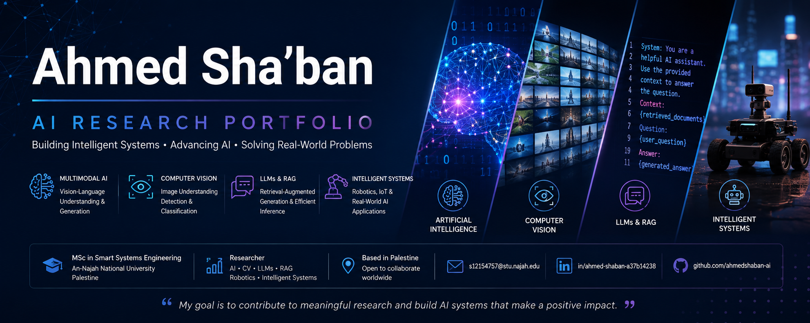

# Ahmed Sha'ban — Research Portfolio

## Artificial Intelligence | Computer Vision | Multimodal AI | Intelligent Systems

I am a Master's student in Smart Systems Engineering at An-Najah National University, Palestine.

My work focuses on artificial intelligence, computer vision, multimodal systems, vision-language models, retrieval-augmented generation, efficient language-model deployment, and hardware-integrated intelligent systems.

I am currently seeking a funded research internship, visiting research position, research assistant opportunity, or externally co-supervised Master's research project.

---

## About Me

- MSc Student in Smart Systems Engineering
- GPA: 3.58/4.00
- Completed all Master's coursework
- Currently at the Master's research stage
- Based in Nablus, Palestine
- Available for research collaboration in Europe
- Open to working on a new research topic proposed by a host laboratory
- My university can appoint an internal academic supervisor for external thesis collaboration

---

## Research Interests

- Multimodal Artificial Intelligence
- Computer Vision
- Vision-Language Models
- Large Language Models
- Retrieval-Augmented Generation
- Efficient and Quantized AI Models
- Trustworthy Machine Learning
- Generative AI
- Robotics and Intelligent Systems
- AI for Real-World Applications

---

## Featured Research Projects

### 1. Multimodal Image-to-Story Generation

A multimodal research system combining image understanding, semantic retrieval, context-aware prompt construction, and Arabic story generation.

**Technologies:**  
Python, PyTorch, Qwen2.5, FAISS, Hugging Face Transformers, CUDA, GGUF, RAG

**Highlights:**

- Developed and processed a dataset of 100,000 real images
- Designed a FAISS-based semantic retrieval pipeline
- Generated Arabic stories from single and sequential images
- Explored quantized models and consumer-GPU inference
- Prepared automatic and human evaluation workflows

[View Repository](https://github.com/ahmedshaban-ai/multimodal-image-to-story-generation)

---

### 2. E-Commerce Product Image Quality Classification

A deep-learning system for classifying product-image quality into five visual-quality categories.

**Technologies:**  
Python, PyTorch, CNNs, Torchvision, scikit-learn, Matplotlib

**Highlights:**

- Built a baseline convolutional neural network
- Implemented preprocessing and augmentation
- Evaluated performance using accuracy and classification metrics
- Designed a reusable PyTorch training pipeline
- Planned transfer-learning experiments using ResNet and EfficientNet

[View Repository](https://github.com/ahmedshaban-ai/deep-learning-image-quality)

---

### 3. Swarm Robotics Coordination

A four-robot JetBot system in which one robot becomes a leader based on visual detection while the remaining robots coordinate through server-mediated communication.

**Technologies:**  
Python, OpenCV, WebSockets, Jetson Nano, Computer Vision

**Research Areas:**

- Leader detection
- Distributed communication
- Multi-robot coordination
- Real-time vision processing

Repository coming soon.

---

### 4. Autonomous Car Prototype

A computer-vision and sensor-based prototype for detecting traffic signs and responding through real-time hardware control.

**Technologies:**  
OpenCV, Computer Vision, Sensors, Embedded Systems

Repository coming soon.

---

### 5. Gold Price Decision Support System

A machine-learning workflow for analyzing XAUUSD price movements using time-series features and classification models.

**Models:**

- Logistic Regression
- Random Forest
- Support Vector Machine

Repository coming soon.

---

## Technical Skills

### Programming

`Python` `C++` `C#` `PHP` `SQL` `JavaScript`

### Artificial Intelligence

`PyTorch` `Hugging Face Transformers` `scikit-learn` `OpenCV` `CNNs` `Deep Learning`

### Multimodal and Generative AI

`Qwen2.5` `Vision-Language Models` `RAG` `FAISS` `GGUF` `LoRA` `QLoRA`

### Systems and Hardware

`CUDA` `GPU Inference` `Jetson Nano` `IoT` `Sensors` `Biometric Devices`

### Development Tools

`Git` `GitHub` `VS Code` `MySQL` `Windows` `Linux`

---

## Research Experience

### Master's Thesis Researcher  
**An-Najah National University | 2025–Present**

Supervisor: Dr. Amjad Hawash

- Developed and processed a large-scale dataset of 100,000 real images
- Designed semantic retrieval workflows using FAISS
- Implemented Qwen2.5-based generation pipelines
- Conducted GPU inference using PyTorch, Transformers, CUDA, and quantized models
- Built workflows for data preparation, prompt construction, generation, and evaluation
- Explored LoRA, QLoRA, vision-language models, and efficient deployment

---

## Education

### MSc in Smart Systems Engineering  
**An-Najah National University**

- GPA: 3.58/4.00
- Completed all 30 coursework credit hours
- Current stage: Master's research

### BSc in Computer Science  
**An-Najah National University**

---

## Research Collaboration

I am open to:

- Funded research internships
- Visiting researcher or visiting student positions
- Externally co-supervised Master's research projects
- Research assistant opportunities
- AI and computer-vision collaborations
- New research projects proposed by a host laboratory

My university can provide an internal academic supervisor and institutional support for an external Master's research project.

---

## Curriculum Vitae

My academic CV is available here:

[Download CV](docs/Ahmed_Shaban_CV.pdf)

---
## Additional Information

- [Detailed Research Interests](research/research_interests.md)
- [Featured Projects](projects/featured_projects.md)
- [Research Availability](research/availability.md)
- [Academic CV](docs/Ahmed_Shaban_CV.pdf)
- 
## Contact

**Ahmed Sha'ban**

- Email: s12154757@stu.najah.edu
- LinkedIn: [Ahmed Sha'ban](https://www.linkedin.com/in/ahmed-shaban-a37b14238/)
- GitHub: [ahmedshaban-ai](https://github.com/ahmedshaban-ai)
- Location: Nablus, Palestine
